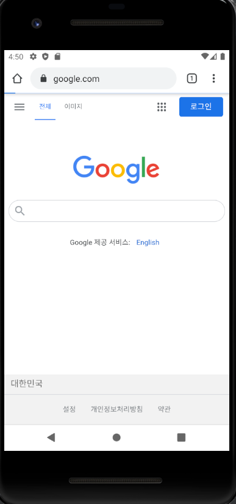

# 20173060 이혜정

## 1주차 과제

## 2주차 과제
</img>

## 3주차 과제
</img>
</img>

## 4주차 과제
### 아이디어 정리

#### 지하철 내 서비스 안내 앱

##### 서울의 모든 지하철역 내 무인 보조배터리 부스, 물품보관소, 화장실의 위치를 안내합니다.
##### - 보조배터리 사용을 위해 설치, 가입해야 하는 어플과 위치 안내
##### - 물품 보관소 위치 안내
##### - 지하철 개찰구 내 또는 외에 위치한 화장실 위치 안내 

## 5주차 과제
</img>
</img>

## 9주차 과제
</img>
